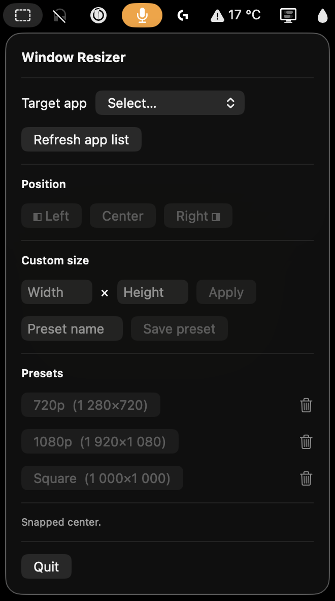

# Window Resizer

A lightweight macOS menu-bar utility for resizing and snapping any app's window
to preset sizes or screen halves.

Built with SwiftUI and the Accessibility API.

<p align="center">
  
</p>

## Features

- Lives in the menu bar — no Dock icon, no app-switcher entry
- Snap any window to **Left half**, **Right half**, or **Center** of the screen
- Apply a **custom size** (width × height) to any app's window
- Save the current custom size as a named **preset** (presets persist across launches)
- Smooth animated transitions when snapping/resizing
- Multi-display aware — uses the display the target window currently lives on

## Requirements

- macOS 14 or later
- Accessibility permission (granted on first run; see below)

## Install

This app is **not signed or notarized** (I don't have an active Apple
Developer account). macOS will block it on first launch which is expected, and
the steps below show how to allow it.

1. Download the latest `WindowResizer.app.zip` from the
   [Releases](../../releases) page.
2. Unzip it and move `WindowResizer.app` to `/Applications`.
3. Because the app is unsigned, macOS will refuse to open it the first time.
   Remove the quarantine flag from a Terminal:

   ```bash
   xattr -dr com.apple.quarantine /Applications/WindowResizer.app
   ```

   Alternatively, right-click the app → **Open** → confirm **Open** in the
   dialog that appears.
4. Launch the app. It should appear as a small icon in the menu bar.
5. Grant Accessibility access:
   - Click **Request Access** in the popover, or
   - Open **System Settings → Privacy & Security → Accessibility** and
     enable **Window Resizer** manually.
6. Click **Re-check** in the popover. You're ready.

## Usage

Click the menu-bar icon to open the popover.

1. Pick a target app from the **Target app** dropdown.
2. Click **Left**, **Center**, or **Right** to snap, or
3. Type a **custom size** and click **Apply**, or
4. Click a saved **preset**.

To save a preset, type a width and height plus a name, then click **Save preset**.
Delete a preset with the trash icon next to it.

## Build from source

Requires Xcode 16 or later.

```bash
git clone https://github.com/jhneng/WindowResizer.git
cd WindowResizer
open WindowResizer.xcodeproj
```

Then Build & Run (`⌘R`) the **WindowResizer** scheme.

> ⚠️ **App Sandbox must stay disabled.** Accessibility apps that control other
> processes can't run inside the sandbox. The project ships with sandboxing
> off — don't re-enable it.

## How it works

`WindowResizer.swift` wraps the macOS Accessibility (`AX*`) APIs to read and
write the target window's position and size attributes. Snapping animates by
interpolating intermediate frames with an ease-out cubic curve over ~180 ms.

Coordinates are converted between Cocoa's bottom-left origin and AX's
top-left origin using the primary screen's height as the reference.

## License

MIT — see [LICENSE](LICENSE).
